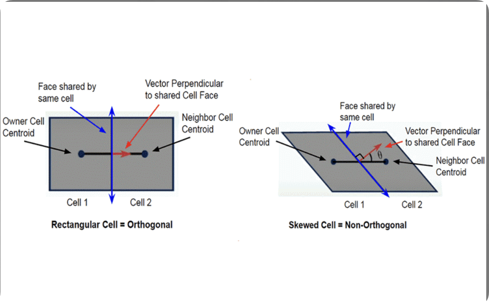
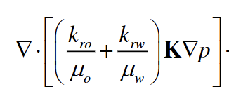

# 无网格算法

1.计算流程

test

2.Dirichlet边界条件

2.1 偏微分方程是什么：偏微分方程是一个包含时间和空间等多个自变量的方程，方程中包含一个物理量（如温度、压力、位移等）对这些自变量的偏导数。求解这个偏微分方程的目的，是为了在任意时间和空间点上，得到该物理量的数值分布。

知道偏微分方程是什么，并知道解偏微分方程的目的就是为了获取某一时间，某一空间的物理量的值，下一步就是开始看如何解偏微分方程。

2.2 求解一个偏微分方程都需要什么：

a.偏微分方程本身

b.初始条件

<figure><figcaption></figcaption></figure>

c.边界条件

<figure><figcaption></figcaption></figure>

<figure><figcaption></figcaption></figure>

d.求解域和时间范围

e.其他确定的物理性质的参数的值

f.离散偏微分方程的离散方法

对于边界条件来说，分别有三种边界条件：

<figure><figcaption></figcaption></figure>

<figure><figcaption></figcaption></figure>

综上最终可以得到，dirichlet边界条件就是控制了空间边界上的物理值。

在渗流过程中，控制含水饱和度和聚合物浓度为固定的物理值的实际意义就是，在边界源源不断的注入对应的含有聚合物的水来进行驱油。

3. 守恒方程的构建

<figure><figcaption></figcaption></figure>

<figure><figcaption></figcaption></figure>

其中源汇项q，正负及其实际物理意义为：

<figure><figcaption></figcaption></figure>

<figure><figcaption></figcaption></figure>

此时当前点的流入流出和注入采出可以实现平衡。

4. 获取所有的物质守恒方程（构建要求解物理量的偏微分方程）：

水相的物质守恒方程；油相的物质守恒方程；总的物质守恒方程；聚合物的物质守恒方程。

5. 将总的物质守恒离散化求解偏微分方程：

5.1 将物质守恒方程积分

ps：积分完以后，接下来不同的处理方法就对应不同的pde离散方法，下面的将达西速度应用散度定理就是mfd算法，而无网格算法是将达西速度散度的积分通过泰勒展开并用最小二乘法取误差最小的时候估计出来。

5.2 积分以后对达西速度的散度的积分应用散度定理：

<figure><figcaption></figcaption></figure>

<figure><figcaption></figcaption></figure>

积分完以后，并且应用完散度定理后：

<figure><figcaption></figcaption></figure>

散度定理就是一个区域产生或消失了多少的流体，就等于此区域的边界即表面一共流出流入多少。

6. 正交网格与非正交网格：

<figure><figcaption></figcaption></figure>

正交网格的定义是：对于任意两个相邻单元，其单元中心的连线方向与它们共享边界面的法向量方向一致（或共线）时，称这对单元之间是正交的。若整个网格系统都满足此条件，则称该网格是正交网格。

7. 通过临界网格表示达西速度的散度的积分

<figure><figcaption></figcaption></figure>

<figure><figcaption></figcaption></figure>

下式为水相和油相的总和达西速度的散度（实际物理意义就是液体流动的在各个方向的总和）

<figure><figcaption></figcaption></figure>

下式为积分后并应用散度定理，将▽算子转化为面通量。

<figure><figcaption></figcaption></figure>

然后进一步转化为空间内每个网格的每个边的通量和：

<figure><figcaption></figcaption></figure>

然后提取其中的每个网格的每个边的通量，做新的定义：

<figure><figcaption></figcaption></figure>

然后通过一个算法将其转化为（文献里面的算法）：

<figure><figcaption></figcaption></figure>

补充：张量的含义

<figure><figcaption></figcaption></figure>

下一步是计算连通传导率T向量表：

<figure><figcaption></figcaption></figure>

其中的第一项和第二项都是通过MFD推导出来的：

<figure><figcaption></figcaption></figure>

<figure><figcaption></figcaption></figure>

补充：第一项和第二项的实际意义

<figure><figcaption></figcaption></figure>

带回原有应用完散度定理的达西速度散度的积分的公式：

<figure><figcaption></figcaption></figure>

最后将其代入最初的总物质守恒方程：

<figure><figcaption></figcaption></figure>

此外，在单元之间的公共边界上，必须满足通量连续性条件。这个条件要求通过这条公共边的通量代数和必须为零。

<figure><figcaption></figcaption></figure>

此时回归到最初解决的问题——解偏微分方程，其主要目的是求出每一个时间步上，每一个网格的压力。

同时在mfd中，其把不光求了每个网格的中心压力，其还涉及到每个网格的边的压力，所以其要解的未知数就有网格中心压力和边压力，所以，要想求得其线性方程组的解，就要有相同数量的方程，所以引入通量连续性条件，再加上之前的总物质守恒方程，方程数就等于未知数数量，未知数数量也叫自由度。

且在线性方程组中，并没有除要求的压力以外的未知数，连通传导率表也在上文求得，故，mfd到此结束，pde方程离散化问题解决，且求出了每个时间步，每个空间网格上的压力物理值。到此，已经完成了一半的工作。

8. 连续变量与非连续变量的区别：

<figure><figcaption></figcaption></figure>

压力已在上文通过MFD离散守恒方程得到其解；而下文要通过DG方法将含水饱和度和聚合物浓度求出来。其中MFD解决的是连续变量压力的问题，而DG解决的是非连续变量含水饱和度以及聚合物浓度的问题。

9. 迎风处理的定义：

<figure><figcaption></figcaption></figure>

10. 含水饱和度的求法

10.1 含水饱和度是什么

含水饱和度是一个会随着时间和空间变化的非连续的物理量。

对于这种物理量，需要找到一个含有这个变量的偏微分方程，并通过划分网格和时间步，离散化这个偏微分方程并给出最终的唯一解。

故此问题转变为，解偏微分方程问题，下一步就是去找要解的偏微分方程是什么。

10.2 水相守恒方程

<figure><figcaption></figcaption></figure>

此方程就是上文所说的，需要解的偏微分方程，且其中具有含水饱和度这一物理量。

10.3 用DG算法解偏微分方程

表示解与试验函数：

<figure><figcaption></figcaption></figure>

弱形式 & 局部积分：

<figure><figcaption></figcaption></figure>

