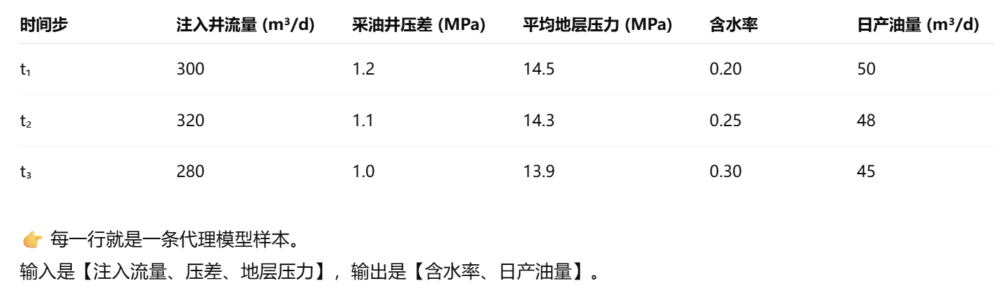

# 基于图结构油藏强化学习生产优化研究

1. 什么是生产优化，生产优化具体的定义是什么，其输入输出是什么，最终实现的目的是什么

生产优化就是通过调整油藏注采策略等可变参数，从而影响正常油藏的产出，进而影响油田的生产效益，通过不断的调整参数，从而使油田保持在一个相对高的收益指标。

最优注采策略，生产优化的目的就是生成一个最优注采策略，这个最优注采策略就是在保持注水总量不变的情况下，**最优注采策略 = “在哪口井注多少水、从哪口井采多少油”。**

最优注采策略针对的是指标是什么，为什么是最优的？如何评价一个注采策略的优劣。

最优注采策略是通过数值模拟或者代理模型对某一个油藏进行在一定时间步上关于生产数据的预测，得到这些预测的数据，总的分析什么注采策略对于当前的油藏模型这段时间的累计产油量最多，对比即可得到最优注采策略。

数值模拟与代理模型，二者实现的都是对地质参数相同的同一油藏模型进行在时间步上的预测。

闭环油藏管理（Closed-Loop Reservoir Management, CLRM）

数值模拟预测 → 实际生产反馈 → 模型校正 → 再预测与优化 → 实际验证 → 再校正。

代理模型则是通过数值模拟出的生产数据作为数据集进行训练。其都是针对同一地质油藏模型进行预测的，其改变的是注采策略的不同，即每个注水井要注多少水。

<figure><figcaption></figcaption></figure>

<figure><figcaption></figcaption></figure>

1. 强化学习是什么，其定义是什么，输入输出是什么，强化学习与生产优化的关系是什么，为什么强化学习可以用在生产优化上，强化学习是什么算法，他与图结构的油藏有什么关系
2. 图结构的油藏与生产优化的关系，为什么图结构的油藏可以用于生产优化，生产优化需要用到图结构的油藏模型什么性质
